# Smart Task Management App

A full-featured MERN stack application for smart task management with user and admin roles, AI-powered features, audit logs, and export options.

---

## 🚀 Features

### **User Features**
- Register/login (User or Admin, with admin code)
- Create, view, edit, and delete tasks
- Task categories, due dates, and status tracking
- AI-powered task category prediction and description generation
- Personal dashboard with task stats

### **Admin Features**
- Admin dashboard with system stats
- User management (view, edit role, deactivate/reactivate, delete)
- View audit logs (user actions)
- AI-powered reports (e.g., tasks per category)
- Export data (CSV, Excel, PDF)

### **General**
- Responsive, modern UI (Material-UI)
- Role-based access control (admin/user)
- Google OAuth login
- Secure JWT authentication
- MongoDB Atlas support
- Audit logging for key actions

---

## 🛠️ Tech Stack

- **Frontend:** React (Vite), Material-UI, Context API, Axios, React Router
- **Backend:** Node.js, Express, MongoDB (Mongoose), JWT, Passport.js, OpenAI API
- **AI:** OpenAI integration for smart features
- **Export:** CSV, Excel, PDF (backend utility)
- **Deployment:** Vercel/Netlify (frontend), Render/Heroku (backend), MongoDB Atlas

---

## ⚙️ Setup & Installation

### **1. Clone the Repository**
```bash
git clone <your-repo-url>
cd Smart-Task-Management-App
```

### **2. Backend Setup**
```bash
cd server
npm install
```
- Create a `.env` file in `/server`:
  ```
  MONGO_URI=your_mongodb_atlas_uri
  JWT_SECRET=your_jwt_secret
  OPENAI_API_KEY=your_openai_api_key
  ```
- Start the backend:
  ```bash
  npm run dev
  # or
  node server.js
  ```

### **3. Frontend Setup**
```bash
cd ../client
npm install
npm run dev
```
- The app runs at [http://localhost:3000](http://localhost:3000)

---

## 📝 Usage

### **Registration**
- Go to `/register`
- Choose role: **User** or **Admin**
  - To register as admin, enter the admin code: `admin2025`
- After registration, you'll be redirected to the appropriate dashboard.

### **User Dashboard**
- Manage your tasks (CRUD)
- Use AI features for category/description
- View personal stats

### **Admin Dashboard**
- Access via sidebar or `/admin`
- Manage users (change role, deactivate/reactivate, delete)
- View audit logs
- See AI-powered reports
- Export data

### **Login**
- Standard login or Google OAuth

---

## 🧑‍💻 Project Structure

```
Smart Task Management App/
# frontend
  client/
├── public/
│   └── vite.svg
├── src/
│   ├── assets/
│   │   └── react.svg
│   ├── components/
│   │   ├── admin/
│   │   │   ├── AdminDashboard.jsx
│   │   │   └── UserManagement.jsx
│   │   ├── auth/
│   │   │   ├── Login.jsx
│   │   │   └── Register.jsx
│   │   ├── common/
│   │   │   └── LoadingSpinner.jsx
│   │   ├── dashboard/
│   │   │   └── Dashboard.jsx
│   │   ├── layout/
│   │   │   └── Layout.jsx
│   │   └── tasks/
│   │       ├── TaskDetail.jsx
│   │       ├── TaskForm.jsx
│   │       └── TaskList.jsx
│   ├── contexts/
│   │   ├── AuthContext.jsx
│   │   └── TaskContext.jsx
│   ├── App.css
│   ├── App.jsx
│   ├── index.css
│   └── main.jsx
├── package.json
├── package-lock.json
├── vite.config.js
└── README.md

# backend
server/
├── middleware/
│   ├── auth.js
│   ├── errorHandler.js
│   ├── isAdmin.js
│   └── passport.js
├── models/
│   ├── AuditLog.js
│   ├── Task.js
│   └── User.js
├── routes/
│   ├── admin.js
│   ├── ai.js
│   ├── auth.js
│   ├── tasks.js
│   └── users.js
├── utils/
│   └── exportUtils.js
├── server.js
├── package.json
├── package-lock.json
├── .env.example
├── .gitignore
├── setup.md
├── start-backend.js
└── test-backend.js
```

---

## 🌐 Deployment

### **Frontend**
- Deploy `/client` to Vercel, Netlify, or similar.
- Set API base URL to your backend's deployed URL.

### **Backend**
- Deploy `/server` to Render, Railway, Heroku, or similar.
- Set environment variables in your deployment dashboard.

### **Database**
- Use MongoDB Atlas for cloud database.

---

## 🔒 Security Notes

- Only users with the correct admin code (`admin2025`) can register as admin.
- All admin routes are protected on both frontend and backend.
- JWT authentication for all API requests.

---

## 🤖 AI Features

- **Task Category Prediction:** Suggests a category for your task using OpenAI.
- **Description Generation:** Generates smart task descriptions.
- **Admin Reports:** AI-powered analytics for admins.

---

## 📦 Export Options

- Export tasks, users, or logs as CSV, Excel, or PDF from the admin dashboard.

---

## 📝 Audit Logging

- All key actions (task/user changes, logins, etc.) are recorded and viewable by admins.

---

## 🖼️ Screenshots

### Dashboard
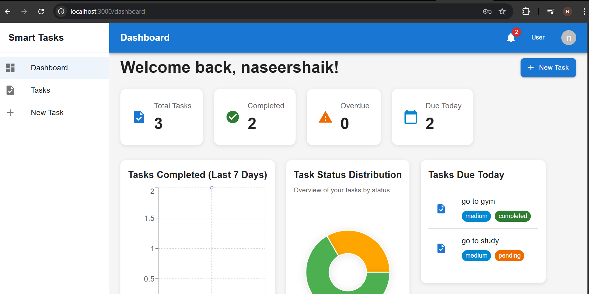

### Admin Dashboard
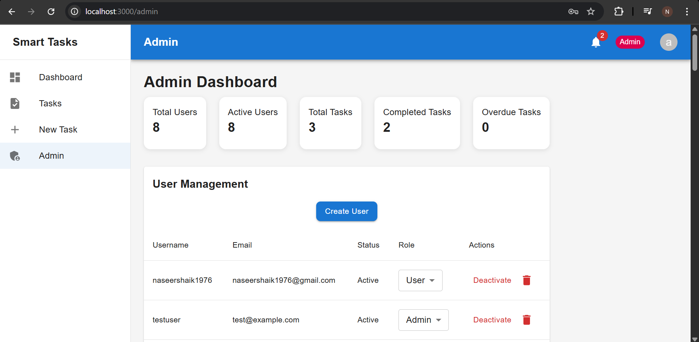

### Admin AI Report
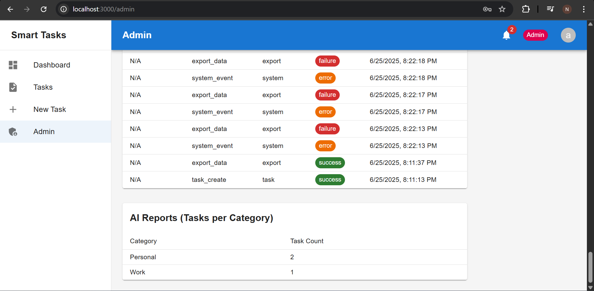

### Audit Logs
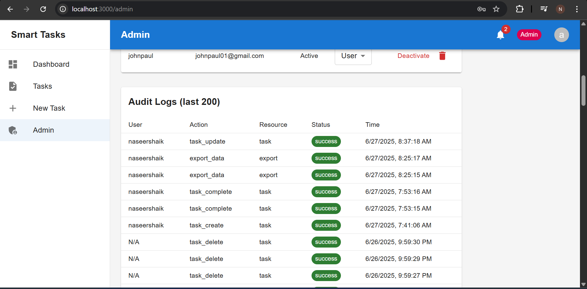

### Dark Mode
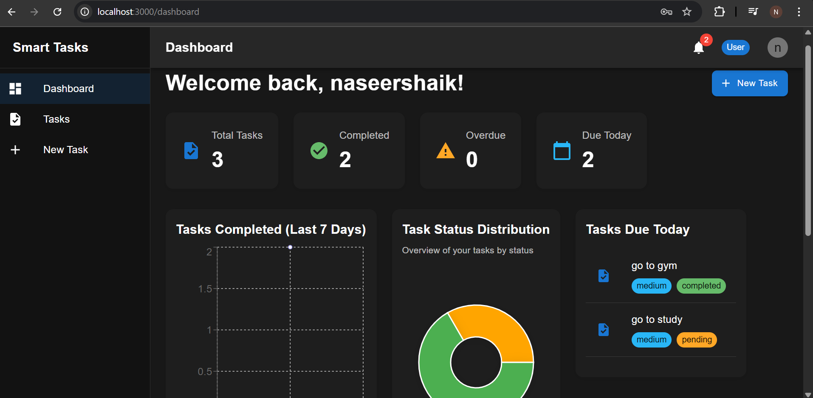

### Notifications
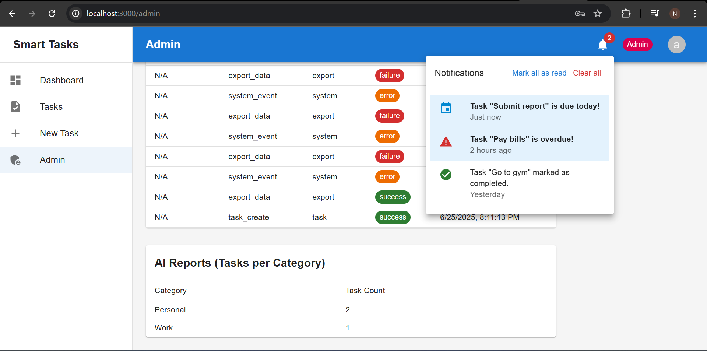

### Register
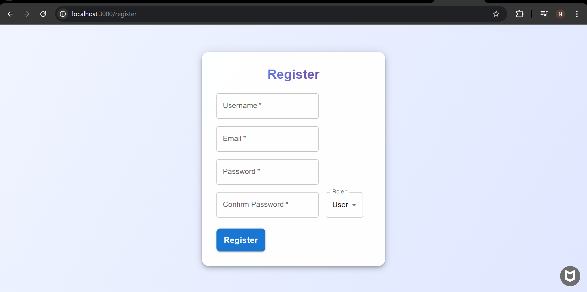

### Sign In


### Task Creation
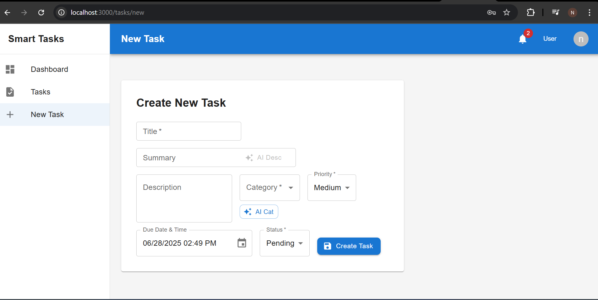

### Task List


### User Profile
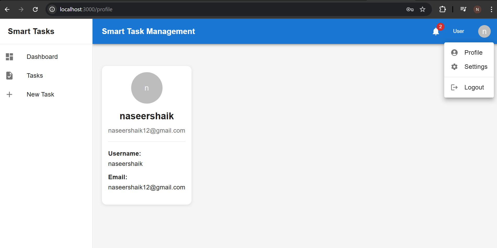

### User Management
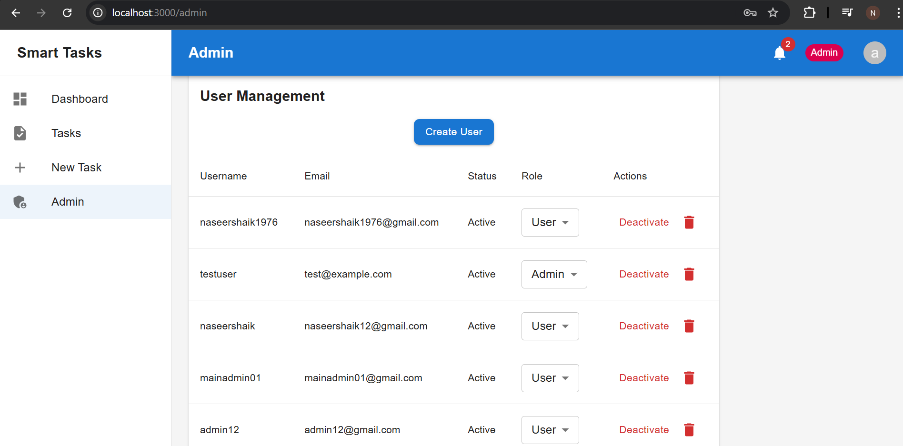

### Settings
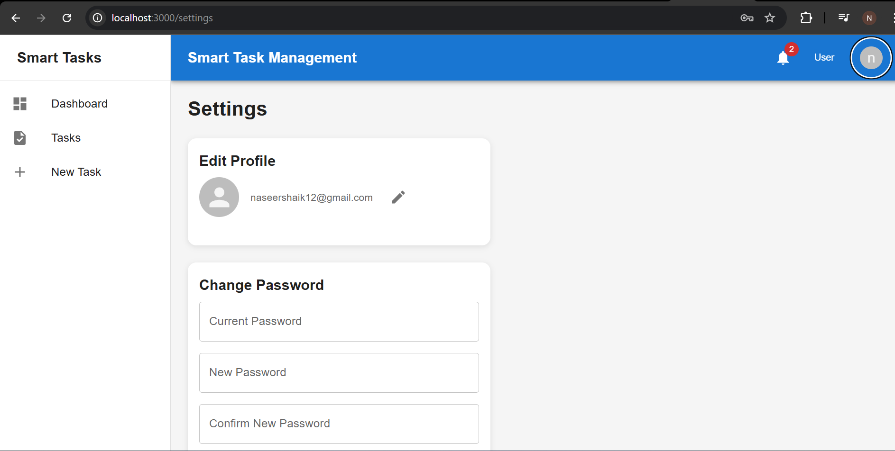

---

## 🙋 FAQ

- **How do I become an admin?**  
  Register with the admin code: `admin2025`.

- **How do I deploy?**  
  See the Deployment section above.

- **How do I use AI features?**  
  Use the AI buttons in the task form and admin dashboard.

---

## 📄 License

MIT License

---

## 👨‍💻 Author

- _Shaik.Naseer_
- _naseershaik1976@gmail.com_

---

**Enjoy your Smart Task Management App!** 